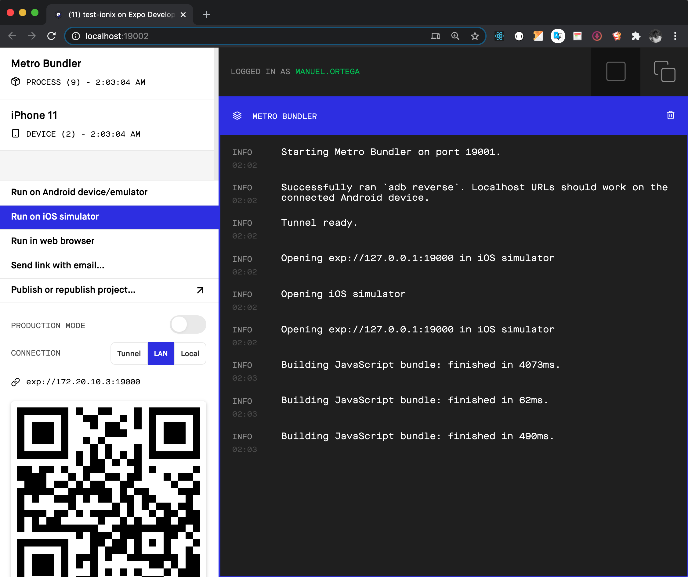

# TEST

## Instrucciones

.- Abrir la terminal

.- Clonar el respositorion ejecutando la instrucción 

```
gi clone git@github.com:mortegac/tets-ionix.git
```

.- Una vez clonado  el proyecto, ingresar en la carpeta utilizando el siguiente comando en la terminal  
```
cd tets-ionix
````

.- Instalar las dependencias utilizando la instrucción

```
yarn install
```

.- Ejecutar el proyecto utilizando 

```
expo start
```

Se abrirá en una ventana del navegador el Metro Bundler

.-  Seleccionar el dispositivo donde se quiera ejecutar




## Ejecutar la aplicación utilizando Expo Client

Esta opción permite ejecutar la aplicación sin la necesidad de publicarla en el store o cargarla en forma manual en el dispositivo

.- Descargar la aplicación `Expo Client` en el dispositivo móvil:

- ANDROID: https://play.google.com/store/apps/details?id=host.exp.exponent&
referrer=www

- IOS: https://apps.apple.com/app/apple-store/id982107779
